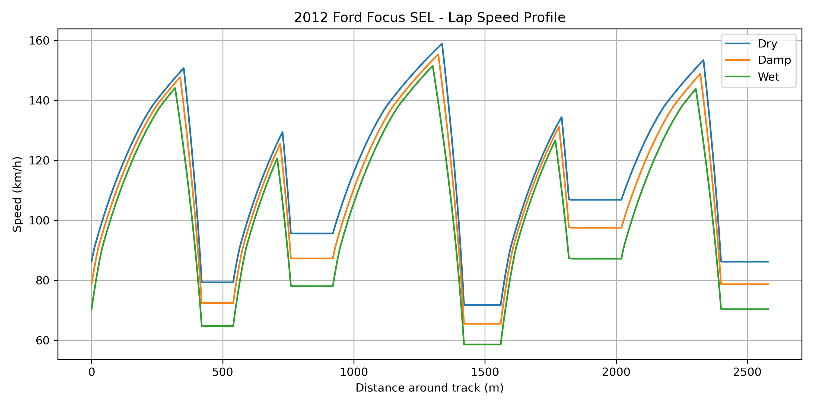
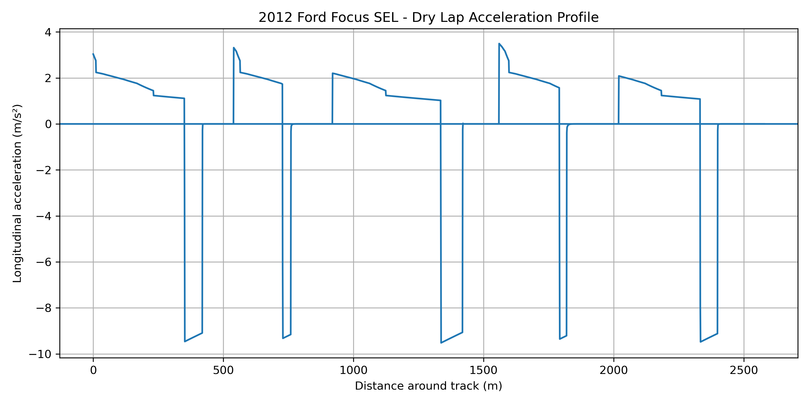

# Vehicle Performance & Lap Time Simulation

Python-based vehicle dynamics simulation developed to model the performance of a 2012 Ford Focus SEL around a simulated closed circuit.
The model integrates engine performance, transmission gearing, aerodynamic resistance, tire grip, acceleration, braking, and cornering constraints to calculate vehicle speed throughout a lap.

## Overview

The track is divided into 1 m increments, allowing vehicle performance to be evaluated at 2,580 simulation points per lap.
Three driving conditions are modeled:
- Dry
- Damp
- Wet
Across all three conditions, the program evaluates 7,740 simulation points and calculates the resulting speed profile and lap time.

## Vehicle Model

The simulation models a 2012 Ford Focus SEL with a 2.0 L engine and 6-speed PowerShift transmission.
Key vehicle parameters include:
- Vehicle mass: 1331 kg
- Maximum power: 119.3 kW (160 hp)
- Maximum torque: 198 N·m
- Front-wheel drive
- 215/55R16 tires
- 6-speed transmission
- Aerodynamic drag
- Rolling resistance
- Drivetrain efficiency
- Tire-road friction
An estimated engine torque curve is interpolated across the operating RPM range to determine available engine torque at different vehicle speeds.

## Simulation Method

At each point around the track, the program determines the maximum physically allowable vehicle speed.
Acceleration is calculated from available engine torque, transmission gearing, drivetrain efficiency, tire traction, aerodynamic drag, and rolling resistance.
Cornering speed is limited using the lateral acceleration relationship:

`v = sqrt(μgr)`

where `μ` is the tire-road friction coefficient, `g` is gravitational acceleration, and `r` is the corner radius.
A friction-circle approximation is used to account for the shared tire grip required for simultaneous longitudinal and lateral acceleration.
The simulation performs forward passes to determine acceleration limits and backward passes to determine the braking required for upcoming corners. These passes are repeated until the speed profile converges around the closed circuit.

## Results

The model produces lap-time and vehicle-performance data for dry, damp, and wet conditions.
It also identifies:
- Maximum straight-line speed
- Minimum cornering speeds
- The primary speed-limiting section of the track
- Longitudinal acceleration and braking behavior
- Changes in lap performance caused by reduced road grip

## Speed Profile

The velocity profile shows the vehicle accelerating along straights, braking before corners, and maintaining speeds determined by the available tire grip and corner radius.

## Acceleration and Braking

Positive longitudinal acceleration represents acceleration zones, while negative values indicate braking zones.

## Model Assumptions

Several parameters are engineering approximations rather than directly measured vehicle data, including:
- Intermediate values in the engine torque curve
- Drivetrain efficiency
- Tire-road friction coefficients
- Front axle weight distribution
- Frontal area
- Rolling-resistance coefficients
- Constant-radius corner geometry
The simulated track is intentionally simplified into straight and constant-radius sections. Real circuits contain gradual corner entry and exit geometry, which would produce smoother acceleration and velocity profiles.

## Technologies

Python, NumPy, Matplotlib

## Future Improvements

Future development could include more detailed tire modeling, weight transfer, realistic track geometry, gear-shift dynamics, elevation changes, and validation against measured vehicle telemetry.

## Sources

Published vehicle specifications were obtained from the following references:

- [Ford 2012 Focus Owner's Guide](https://www.fordservicecontent.com/Ford_Content/catalog/owner_guides/12focog1e.pdf)
- [Edmunds - 2012 Ford Focus Specifications](https://www.edmunds.com/ford/focus/2012/trims/)
- [2012 Ford Focus Technical Specifications](https://www.new-cars.com/2012/ford/specs/focus.html)

Published specifications were used for vehicle mass, engine output, tire size, and transmission gearing.
Parameters not available as exact manufacturer data were treated as model assumptions and are identified within the source code and README.
